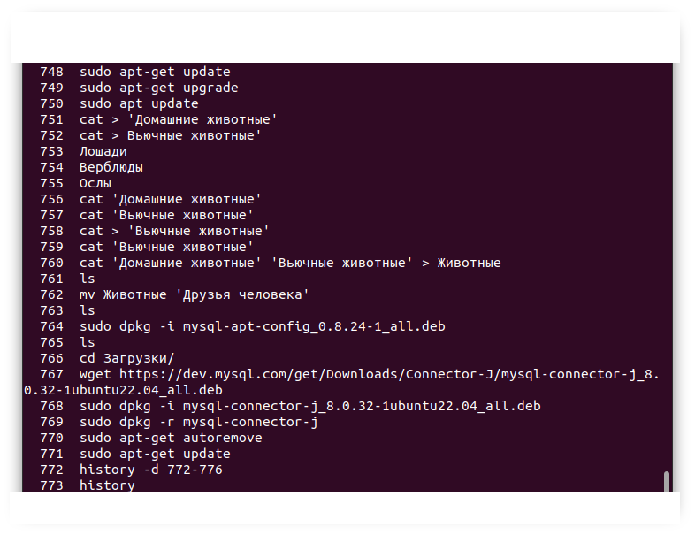

# `Итоговая аттестация. Практическое задание`

## `Информация о проекте`
Необходимо организовать систему учета для питомника, в котором живут домашние и вьючные животные.

## `Задание:`

### 1. Используя команду cat, в терминале операционной системы Linux создать два файла Домашние животные (заполнив файл собаками, кошками, хомяками) и Вьючные животными (заполнив файл лошадьми, верблюдами и ослами), а затем объединить их. Просмотреть содержимое созданного файла. Переименовать файл, дав ему новое имя (Друзья человека).

cat > 'Домашние животные'

В открывшемся файле указываем
Собаки
Кошки
Хомяки

cat > 'Вьючные животные'

В открывшемся файле указываем
Лошади
Верблюды
Ослы

cat 'Домашние животные' 'Вьючные животные' > Животные  
ls  
mv Животные 'Друзья человека'  
ls  

### 2. Создать директорию, переместить файл туда.

mkdir animals  
mv 'Друзья человека' animals/  
ls  

### 3. Подключить дополнительный репозиторий MySQL. Установить любой пакет из этого репозитория.

Скачиваем конфигуратор mysql:  
wget https://dev.mysql.com/get/mysql-apt-config_0.8.24-1_all.deb

Переходим в папку Загрузки и устанавливаем компоненты mysql с помощью конфигуратора:  
cd Загрузки  
sudo dpkg -i mysql-apt-config_0.8.24-1_all.deb  

В процессе установки жмем Ок, чтобы выполнить полную установку

Обновляем информацию о пакетах и видим подключенный репозиторий mysql:  
sudo apt-get update

Устанавливаем mysql-server:  
sudo apt-get install mysql-server

Проверяем результат установки:  
systemctl status mysql

### 4. Установить и удалить deb-пакет с помощью dpkg.

Скачиваем пакет для установки:  
wget https://dev.mysql.com/get/Downloads/Connector-J/mysql-connector-j_8.0.32-1ubuntu22.04_all.deb

Устанавливаем пакет mysql-connector-j_8.0.32-1ubuntu22.04_all.deb:  
sudo dpkg - i ~/Загрузки/mysql-connector-j_8.0.32-1ubuntu22.04_all.deb

Удаляем пакет и его сопутствующие пакеты:  
sudo dpkg -r mysql-connector-j  
sudo apt-get autoremove  

### 5. Выложить историю команд в терминале ubuntu.

Для получения истории введенных команд в терминале ubuntu используем:  
history

Скриншот введенных команд представлен ниже  

### 6. Нарисовать диаграмму, в которой есть класс родительский класс, домашние животные и вьючные животные, в составы которых в случае домашних животных войдут классы: собаки, кошки, хомяки, а в класс вьючные животные войдут: лошади, верблюды и ослы).

Диаграмма классов, в которую входит родительский класс Animal, классы Домашние животные (Pets) и Вьючные животные (PackAnimals), а также классы кошки, собаки, хомяки, лошади, верблюды и ослы, отражающая иерархию классов, представлена ниже:  

Ниже представлена ERD-диаграмма сущностей и их отношений (связей)  

### 7. В подключенном MySQL репозитории создать базу данных "Друзья человека"

CREATE DATABASE IF NOT EXISTS Друзья_человека;  
Use Друзья_человека;  

### 8. Создать таблицы с иерархией из диаграммы в БД.

CREATE TABLE IF NOT EXISTS Animal_class  
(class_id INT PRIMARY KEY AUTO_INCREMENT,  
class_name VARCHAR(20)  
);  

CREATE TABLE IF NOT EXISTS Animal_types  
(type_id INT PRIMARY KEY AUTO_INCREMENT,  
type_name VARCHAR(20),  
class_id INT,  
FOREIGN KEY (class_id) REFERENCES Animal_class(class_id)  
);  

CREATE TABLE IF NOT EXISTS Commands  
(cmd_id INT PRIMARY KEY AUTO_INCREMENT,  
cmd_name VARCHAR(20),  
cmd_action VARCHAR(20)  
);  

CREATE TABLE IF NOT EXISTS Animals  
(id INT PRIMARY KEY AUTO_INCREMENT,  
class_id INT,  
type_id INT,  
an_name VARCHAR(20),  
birthday DATE,  
command_id INT,  
INDEX `id_idx` (`id` ASC) VISIBLE,  
FOREIGN KEY (class_id) REFERENCES Animal_class(class_id),  
FOREIGN KEY (type_id) REFERENCES Animal_types(type_id),  
FOREIGN KEY (command_id) REFERENCES Commands(cmd_id)  
);  

### 9. Заполнить низкоуровневые таблицы именами (животных), командами, которые они выполняют, и датами рождения.

INSERT INTO Animal_class(class_name) VALUES  
('Домашние животные'),  
('Вьючные животные');  

INSERT INTO Animal_types(type_name, class_id) VALUES  
('Кошка',1),  
('Собака',1),  
('Хомяк',1),  
('Лошадь',2),  
('Верблюд',2),  
('Осёл',2);  

INSERT INTO Commands(cmd_name, cmd_action) VALUES  
('Дай лапу', 'Дает лапу'),  
('Лежать','Ложится'),  
('Кыс-кыс', 'Бежит на голос'),  
('Брысь', 'Убегает'),  
('Сидеть', 'Садится'),  
('Ннннооо','Начинает движение'),  
('Стой','Останавливается');  

INSERT INTO Animals(class_id, type_id, an_name, birthday, command_id) VALUES  
(1,1,'Мурка','2023-01-01',3),  
(1,2,'Жучка','2022-01-01',1),  
(1,3,'Хома','2022-03-03',5),  
(2,4,'Грач','2022-06-06',6),  
(2,5,'Семён','2022-04-04',7),  
(2,6,'Иа','2022-08-08',7),  
(1,1,'Муся','2021-01-01',4),  
(1,2,'Джерри','2021-02-02',2),  
(1,3,'Шуша','2021-03-03',5),  
(2,4,'Стрела','2021-06-06',6),  
(2,5,'Федя','2021-04-04',7),  
(2,6,'Орлик','2021-08-08',7),  
(1,1,'Машка','2015-01-01',3),  
(1,2,'Грета','2015-02-02',1),  
(1,3,'Клепа','2016-03-03',5),  
(2,4,'Буран','2017-06-06',7),  
(2,5,'Лёва','2018-04-04',7),  
(2,6,'Джордж','2020-02-02',7);  
 
SELECT * FROM Animal_class;  
SELECT * FROM Animal_types;  
SELECT * FROM Commands;  
 
SELECT An.id, Cl.class_name, Tp.type_name, An.an_name, An.birthday, Cmd.cmd_name, Cmd.cmd_action  
FROM Animals AS An  
JOIN Animal_class AS Cl  
ON an.class_id=cl.class_id  
JOIN Animal_types AS Tp  
ON an.type_id=tp.type_id  
JOIN Commands AS Cmd  
ON an.command_id=cmd.cmd_id  
ORDER BY An.id ASC;  

### 10. Удалив из таблицы верблюдов, т.к. верблюдов решили перевезти в другой питомник на зимовку, объединить таблицы лошади и ослы в одну таблицу.

CREATE TABLE IF NOT EXISTS Pack_animals  
SELECT An.id, Cl.class_name, Tp.type_name, An.an_name, An.birthday, Cmd.cmd_name, Cmd.cmd_action  
FROM Animals AS An  
JOIN Animal_class AS Cl  
ON an.class_id=cl.class_id  
JOIN Animal_types AS Tp  
ON an.type_id=tp.type_id  
JOIN Commands AS Cmd  
ON an.command_id=cmd.cmd_id  
WHERE Tp.type_name IN ('Лошадь','Осёл')  
ORDER BY An.id ASC;  

SELECT * FROM Pack_animals;  

### 11. Создать новую таблицу “молодые животные”, в которую попадут все животные старше 1 года, но младше 3 лет и в отдельном столбце с точностью до месяца подсчитать возраст животных в новой таблице.

CREATE TABLE IF NOT EXISTS Молодые_животные  
SELECT An.id, Cl.class_name, Tp.type_name, An.an_name, An.birthday, Cmd.cmd_name, Cmd.cmd_action, TIMESTAMPDIFF(MONTH, An.birthday, NOW()) as age_in_months  
FROM Animals AS An  
JOIN Animal_class AS Cl  
ON an.class_id=cl.class_id  
JOIN Animal_types AS Tp  
ON an.type_id=tp.type_id  
JOIN Commands AS Cmd  
ON an.command_id=cmd.cmd_id  
WHERE TIMESTAMPDIFF(MONTH, An.birthday, NOW()) BETWEEN 12 AND 36  
ORDER BY An.id ASC;  

SELECT * FROM Молодые_животные;  

### 12. Объединить все таблицы в одну, при этом сохраняя поля, указывающие на прошлую принадлежность к старым таблицам.

SELECT *  
FROM Animals AS An  
JOIN Animal_class AS Cl  
ON an.class_id=cl.class_id  
JOIN Animal_types AS Tp  
ON an.type_id=tp.type_id  
JOIN Commands AS Cmd  
ON an.command_id=Cmd.cmd_id  
ORDER BY An.id ASC;  

Скрипт выполнения заданий 7-12 приложен в [файле](https://github.com/Alex05524/Final_Attestation/blob/main/Final_work/SQL/FinalTask_Animals.sql)

### 13. Создать класс с Инкапсуляцией методов и наследованием по диаграмме.

Создан абстрактный класс Животное, от которого в соответствии с диаграммой классов наследуются классы Домашние животные (от которого в свою очередь наследуются классы Кошка, Собака, Хомяк) и Вьючные животные (от которого наследуются классы Лошадь, Верблюд, Осёл. Кроме того, указанные классы реализуются те или иные интерфейсы, определяющие, какие команды животное может выполнять по умолчаю и каким образом.  
Все указанные классы находятся в [папке](https://github.com/Alex05524/Final_Attestation/tree/main/Final_work/Core/Models)

### 14. Написать программу, имитирующую работу реестра домашних животных.
В программе должен быть реализован следующий функционал:

#### 14.1. Завести новое животное
#### 14.2. Определять животное в правильный класс
#### 14.3. Увидеть список команд, которое выполняет животное
#### 14.4. Обучить животное новым командам
#### 14.5. Реализовать навигацию по меню

Приложение разработано по архитектуре MVC.  
Класс Controller отвечает за навигацию пользователя по меню.  
Интерфейс IView реализован в классе ConsoleView и отвечает за представление (отображение) в консоли информации, содержащейся в реестре животных.  
Класс Model реализует методы для работы с реестром животных, позволяющие добавить новое животное (либо удалить), определить животное в правильный класс, посмотреть список команд, которое может выполнять животное, а также добавить новые команды конкретному животному (если его класс реализует интерфейс, позволяющий животному обучаться новым командам).  
Для хранения информации о животных (реестра) реализован слой DAO (репозиторий).

### 15. Создайте класс Счетчик, у которого есть метод add(), увеличивающий значение внутренней int переменной на 1 при нажатии "Завести новое животное". Сделайте так, чтобы с объектом такого типа можно было работать в блоке try-with-resources. Нужно бросить исключение, если работа с объектом типа счетчик была не в ресурсном try и/или ресурс остался открыт. Значение считать в ресурсе try, если при заведении животного заполнены все поля.

Реализован класс Счетчик, содержащий метод add(), увеличивающий значение внутренней int переменной на 1 при нажатии "Завести новое животное". Работа с объектом Счетчик возможна только в блоке try-with-resources. В противном случае выбросывается исключение OutResourseException с сообщением о том, что работа с объектом Counter была не в ресурсном try и/или ресурс остался открыт.  
Класс Счетчик находится в [файле](https://github.com/Alex05524/Final_Attestation/blob/main/Final_work/Core/Infrastructure/Counter.java)